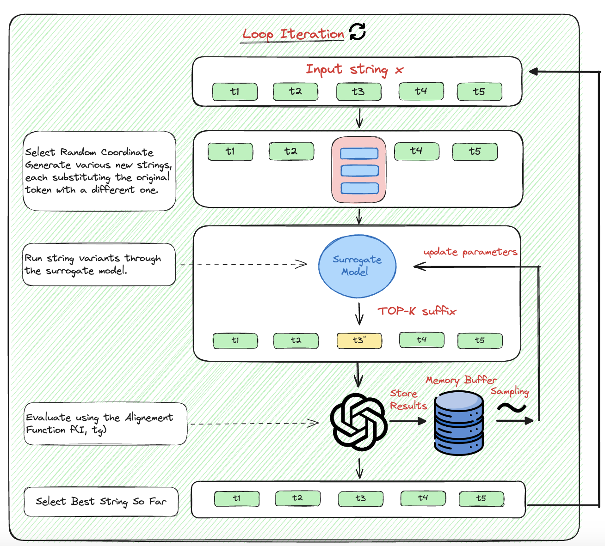

# QROA: A Black-Box Query-Response Optimization Attack on LLMs

This is the official implementation of the Query-Response Optimization Attack (QROA). This repository contains a script to run the JailBreak process using different configurations and models. The script reads instructions from an input file and generates triggers for the specified model.

This Script is the official implementation of the article "*QROA: A Black-Box Query-Response Optimization Attack on LLMs*"

## Abstract

Large Language Models (LLMs) have recently gained popularity, but they also raise concerns due to their potential to create harmful content if misused. This study in- troduces the Query-Response Optimization Attack (QROA), an optimization-based strategy designed to exploit LLMs through a black-box, query-only interaction. QROA adds an optimized trigger to a malicious instruction to compel the LLM to generate harmful content. Unlike previous approaches, QROA does not require access to the model’s logit information or any other internal data and operates solely through the standard query-response interface of LLMs. Inspired by deep Q-learning and Greedy coordinate descent, the method iteratively updates tokens to maximize a designed reward function. We tested our method on various LLMs such as Vicuna, Falcon, and Mistral, achieving an Attack Success Rate (ASR) over 80%. We also tested the model against Llama2-chat, the fine-tuned version of Llama2 designed to resist Jailbreak attacks, achieving good ASR with a suboptimal initial trigger seed. This study demonstrates the feasibility of generating jailbreak attacks against deployed LLMs in the public domain using black-box optimization methods, enabling more comprehensive safety testing of LLMs




## Installation

1. Clone the repository:

    ```bash
    git clone https://github.com/qroa/qroa.git
    cd qroa
    ```

2. Install the required packages:

    ```bash
    pip install -r requirements.txt
    ```

## Usage


### Running the Attack

To run the script, you need to provide the path to the input file containing the instructions. The input file should be in CSV format.
Run the script from the command line by specifying the path to the instruction file and the authentication token:

```bash
python main.py data/instructions.csv [API_AUTH_TOKEN]
```

Replace `instructions.csv` with the path to your text file containing the instructions, and `HUGGING_FACE_AUTH_TOKEN` with the actual authentication token.

### Demo and Testing Model Generation
- **Notebook Demo:** Run `demo.ipynb` to see a demonstration of the process.
- **Notebook Analysis Experiement:** Run `analysis.ipynb` to analyse results and calculate metrics value (ASR).
- **Testing Model:** Generation: Execute `generate.py` to test the generation process on custom instructions and triggers.

This script can be run from the command line as follows:

```bash
python generate.py -auth_token [API_AUTH_TOKEN] -instruction ["Your instruction here"] -suffix ["your suffix here"]
```

Where: 

- **auth_token:** Authentication token required for accessing the model.
- **instruction:** The specific instruction you want the model to follow.
- **suffix:** The adversarial trigger that, when appended to the instruction, causes the LLM to obey the instruction.

### Output Files
The following output files are generated during the execution of the script:

- **Generated Triggers:** `./results/[MODEL_NAME]/triggers.json`  : Contains the triggers generated by the model.
- **Validated Triggers:** `./results/[MODEL_NAME]/triggers_validate.json` : Contains the triggers validated after applying the z test.
- **Trigger Generation Logs:** `./logs/[MODEL_NAME]/logging_generator.csv` : Logs the process of trigger generation.
- **Trigger Validation Logs:** `./logs/[MODEL_NAME]/logging_validator.csv` : Logs the process of validating the triggers with the z test.

## Configuration

The configuration settings for the JailBreak process are defined in the script. Below is a brief explanation of each configuration parameter:

- **model:** The model to use (e.g., vicuna_hf).
- **auth_token:** Authentication token for accessing the model.
- **use_system_prompt:** Boolean to indicate whether to use a system prompt.
- **system_prompt:** The system prompt message.
- **embedding_model_path:** Path to the embedding model.
- **len_coordinates:** Length of the coordinates (e.g., length of token embeddings).
- **learning_rate:** Learning rate for the optimizer.
- **weight_decay:** Weight decay (L2 penalty) for the optimizer.
- **nb_epochs:** Number of epochs per trigger generation.
- **batch_size:** Batch size for training.
- **scoring_type:** Scoring type for the triggers.
- **max_generations_tokens:** Maximum number of tokens to generate.
- **topk:** Top K value for sampling.
- **max_d:** Maximum D value.
- **ucb_c:** Upper Confidence Bound (UCB) constant.
- **triggers_init:** Initial triggers.
- **threshold:** Threshold value.
- **nb_samples_per_trigger:** Number of samples per trigger.
- **logging_path:** Path to the logging directory.
- **results_path:** Path to the results directory.
- **temperature:** Sampling temperature.
- **top_p:** Top P value for nucleus sampling.
- **p_value:** P-value for statistical testing.
